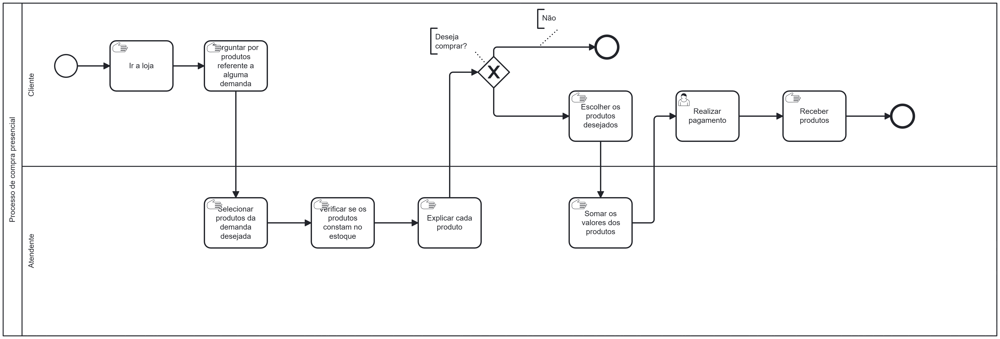
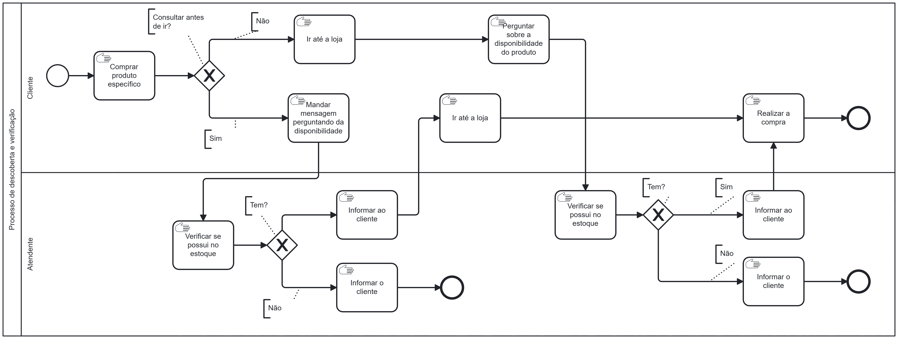
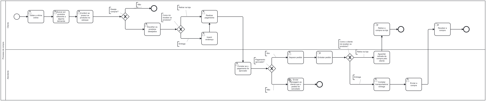
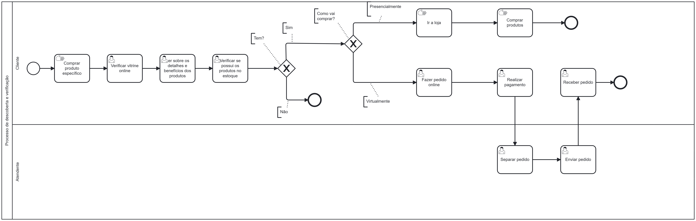

## 3. Modelagem dos Processos de Negócio

### 3.1. Modelagem da situação atual (Modelagem AS IS)

O modelo de processo a seguir representa a atualidade da compra presencial:

Já este modelo, representa a atualidade da descoberta e verificação de produtos da loja:

### 3.2. Análise dos processos

#### Processo de descoberta e verificação
Este processo reflete como o cliente tenta interagir com a loja antes de se deslocar fisicamente. Atualmente, ele é caracterizado por uma dependência da ida à loja ou de canais de comunicação síncronos (como o WhatsApp). Os principais problemas encontrados nesse processo são os seguintes:

Gargalo no Atendimento (Comerciante): Como a comerciante precisa pausar suas atividades físicas na loja para responder mensagens de estoque e preço, cria-se um gargalo. A capacidade de resposta é limitada pela disponibilidade humana, o que gera atrasos significativos para o cliente.

Falha de Comunicação e Assimetria de Informação: O cliente não possui autonomia para consultar o catálogo. Se a comerciante estiver ocupada e não responder a tempo, o cliente pode assumir que o produto não existe ou desistir da compra.

Ineficiência por Deslocamento Desnecessário: No cenário onde o cliente decide ir à loja, existe o risco real de o produto não estar disponível. Isso gera frustração e perda de tempo para o cliente, impactando negativamente a fidelização.

Dependência de Horário Comercial: A descoberta só acontece de fato quando a comerciante está ativa nos canais digitais. Fora do horário comercial, o processo fica estagnado.

Analisando todos os problemas, gargalos e ineficiência, os impactos gerados são a experiência do usuário é prejudicada pela incerteza. E para o público idoso, o esforço de se deslocar e não encontrar o produto é um fator de grande insatisfação. Para o negócio, significa perda de oportunidades de venda por falta de uma vitrine 24/7.

------------------------------------------------------------------------------------------------------------------------------------------------------------------------------------------------------------------------------------------------------------------------

#### Processo de compra presencial
O processo de compra presencial, embora funcional, apresenta pontos de retrabalho e lentidão que poderiam ser mitigados com informações prévias.

Retrabalho Informativo: Toda vez que um cliente entra na loja, a comerciante precisa repetir as características e benefícios dos produtos (especialmente para o público de academia e idosos que buscam suplementação). Não há uma fonte de consulta prévia, transformando cada venda em um processo consultivo longo e repetitivo.

Lentidão no Atendimento (Seleção e Soma): O fluxo de "Verificar disponibilidade", "Buscar nas prateleiras" e "Calcular valor" é feito de forma sequencial e manual enquanto o cliente espera. Em momentos de maior movimento, isso gera filas e desconforto.

Falta de Registro de Dados de Interesse: No processo atual, se um cliente entra, pergunta e não compra (conforme o gateway "Deseja comprar? -> Não"), essa informação é perdida. Não há rastro do que os clientes estão buscando mas não encontrando.

Processo Síncrono e Limitado: O fechamento da venda depende exclusivamente da presença física e da interação imediata. Não há como o cliente "adiantar" a escolha ou o pedido.

Por fim, os problemas notados se pautam em baixa escalabilidade. A comerciante só consegue atender um número limitado de pessoas por hora devido à natureza manual da seleção e explicação dos produtos. Além disso, a falta de autonomia do cliente gera um tempo de permanência em loja maior do que o necessário apenas para a transação financeira.

### 3.3. Descrição geral da proposta (Modelagem TO BE)

#### Melhorias
A introdução da tecnologia visa mitigar os gargalos de comunicação e retrabalho. Com o site, a comerciante deixa de ser uma "ponte de dados" para ser uma facilitadora da entrega. As principais melhorias incluem:

Autonomia do Cliente: O catálogo online permite consultas 24/7 de preços, características e disponibilidade.

Descompressão do Atendimento: Redução drástica de mensagens repetitivas no WhatsApp, permitindo que a comerciante foque na gestão e no atendimento presencial de qualidade.

Assertividade no Deslocamento: O cliente só se desloca à loja com a certeza da existência do produto, otimizando o fluxo de pessoas no estabelecimento físico.

#### Limites da Solução

Estoque em Tempo Real: A precisão da disponibilidade depende da atualização manual ou integração simples por parte da comerciante (limite operacional).

Inclusão Digital: Embora facilite para muitos, parte do público idoso ainda pode preferir o contato direto, exigindo que o canal antigo (WhatsApp/Telefone) coexista com o novo.
Tendo identificado os gargalos dos modelos AS IS, apresentem uma descrição da proposta de solução, buscando maior eficiência com a introdução da tecnologia. Abordem também os limites dessa solução e o seu alinhamento com as estratégias e objetivos do contexto de negócio escolhido.

------------------------------------------------------------------------------------------------------------------------------------------------------------------------------------------------------------------------------------------------------------------------
### Processo de compra

O processo de compra presencial torna-se mais ágil, pois o cliente já chega à loja com a decisão tomada ou com o pedido pré-selecionado na vitrine. Com isso, temos as seguintes melhorias:

Redução do Ciclo de Venda: O tempo gasto em "Explicar o produto" é minimizado, pois o cliente já consumiu as informações técnicas no site.

Organização do Atendimento: A comerciante pode se organizar melhor para as retiradas, diminuindo filas e o tempo de espera no balcão.

Foco na Experiência: Com a parte burocrática de "preço e estoque" resolvida, o atendimento presencial pode focar na fidelização e no relacionamento humano, ponto crucial para o público idoso.

### Processo de descoberta e verificação

Neste novo modelo, o fluxo de comunicação via redes sociais é substituído prioritariamente pela consulta ao site. Tendo isso, as melhorias esperadas são:

Eliminação do Tempo de Espera: O cliente não precisa mais aguardar a resposta da comerciante para saber se um item está em estoque.

Qualificação da Visita: O processo termina com um cliente muito mais propenso à compra, pois ele já validou suas necessidades digitalmente.

Disponibilidade Integral: A descoberta do comércio local acontece a qualquer momento, independente do horário de abertura da loja física.

