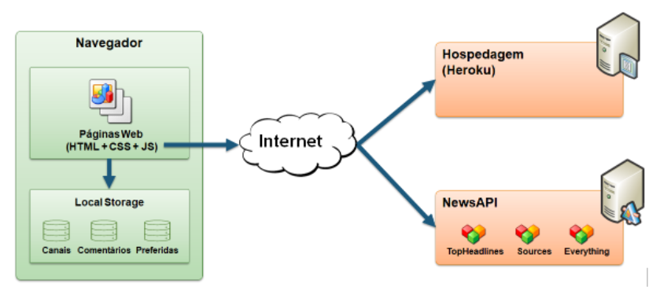
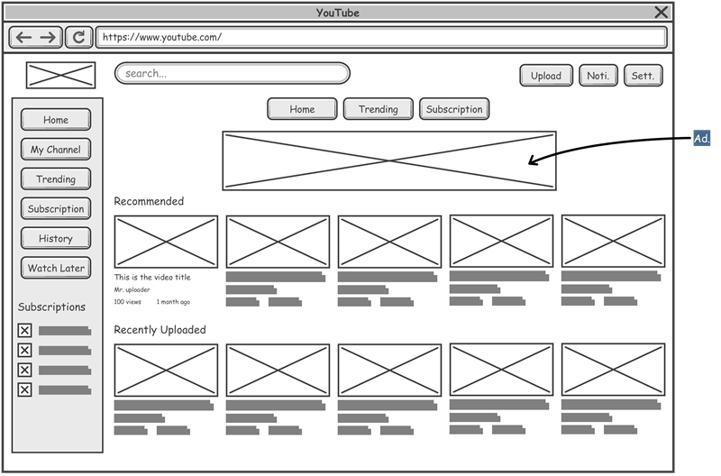
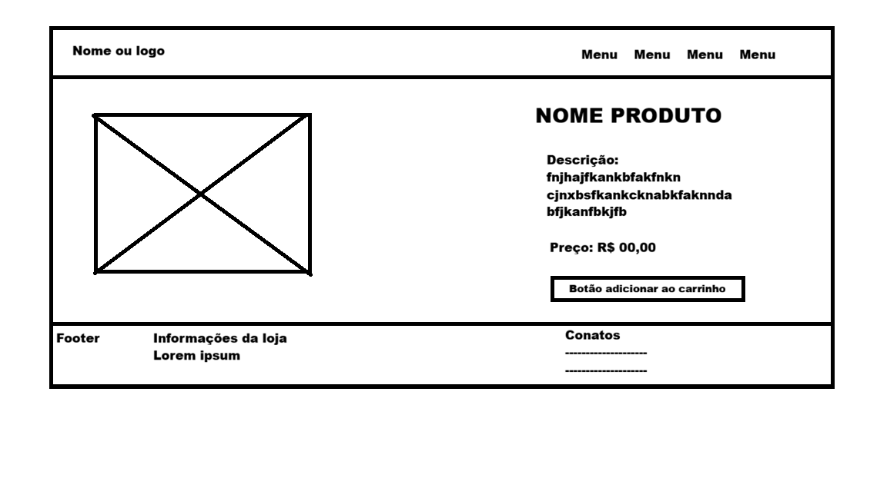
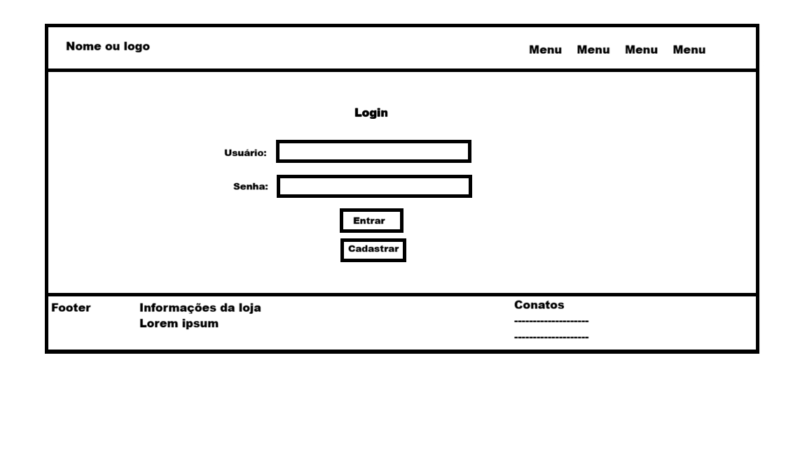
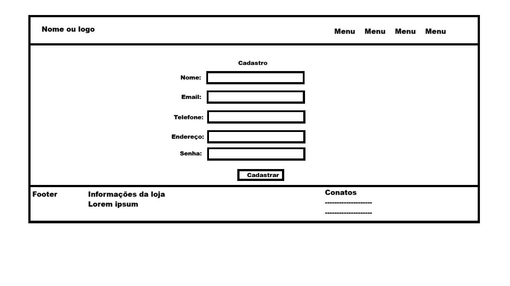
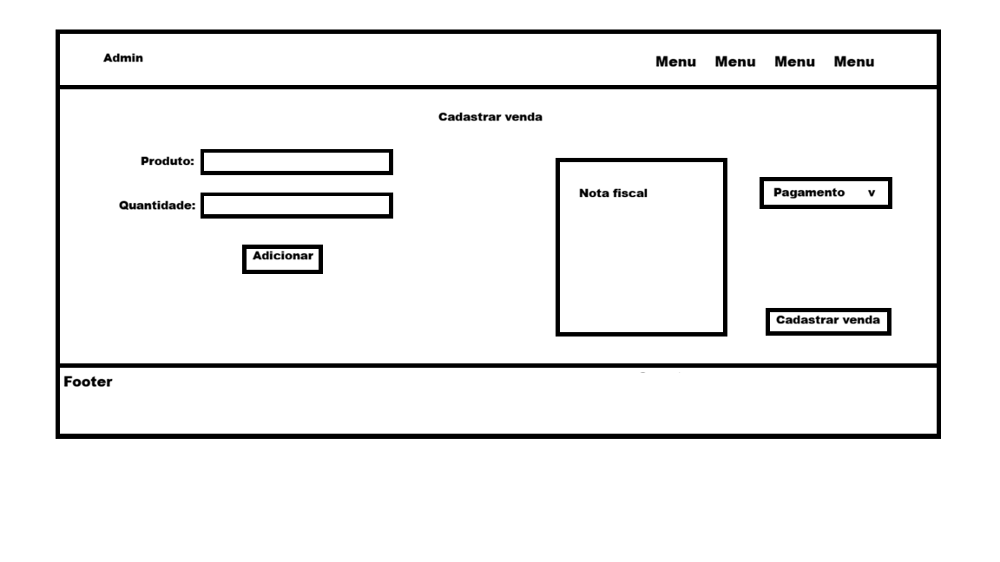
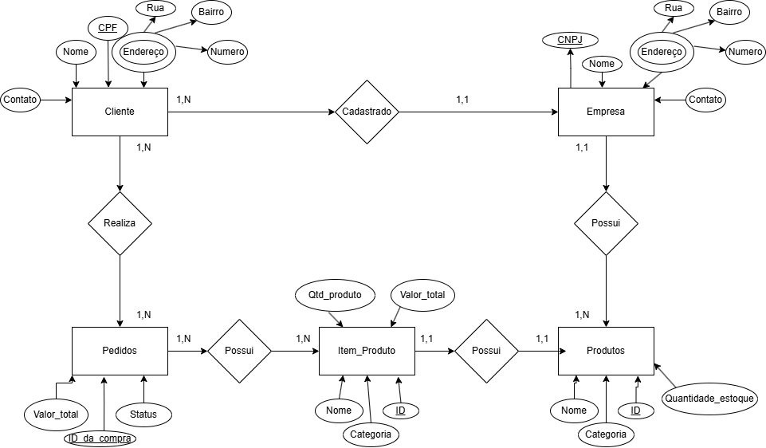

## 4. Projeto da Solução

Pré-requisitos: <a href="03-Modelagem do Processo de Negocio.md"> Modelagem do Processo de Negocio</a>

## 4.1. Arquitetura da solução

......  COLOQUE AQUI O SEU TEXTO E O DIAGRAMA DE ARQUITETURA .......

 Inclua um diagrama da solução e descreva os módulos e as tecnologias
 que fazem parte da solução. Discorra sobre o diagrama.
 
 **Exemplo do diagrama de Arquitetura**:
 
 
 

### 4.2. Protótipos de telas

Visão geral da interação do usuário pelas telas do sistema e protótipo interativo das telas com as funcionalidades que fazem parte do sistema (wireframes).
Apresente as principais interfaces da plataforma. Discuta como ela foi elaborada de forma a atender os requisitos funcionais, não funcionais e histórias de usuário abordados nas <a href="02-Especificação do Projeto.md"> Especificação do Projeto</a>.
A partir das atividades de usuário identificadas na seção anterior, elabore o protótipo de tela de cada uma delas.

## 4.3. Diagrama de Classes

O diagrama de classes ilustra graficamente como será a estrutura do software, e como cada uma das classes da sua estrutura estarão interligadas. Essas classes servem de modelo para materializar os objetos que executarão na memória.

As referências abaixo irão auxiliá-lo na geração do artefato “Diagrama de Classes”.

> - [Diagramas de Classes - Documentação da IBM](https://www.ibm.com/docs/pt-br/rational-soft-arch/9.6.1?topic=diagrams-class)
> - [O que é um diagrama de classe UML? | Lucidchart](https://www.lucidchart.com/pages/pt/o-que-e-diagrama-de-classe-uml)

### 4.4. Modelo de dados

O desenvolvimento da solução proposta requer a existência de bases de dados que permitam efetuar os cadastros de dados e controles associados aos processos identificados, assim como recuperações.
Utilizando a notação do DER (Diagrama Entidade e Relacionamento), elaborem um modelo, na ferramenta visual indicada na disciplina, que contemple todas as entidades e atributos associados às atividades dos processos identificados. Deve ser gerado um único DER que suporte todos os processos escolhidos, visando, assim, uma base de dados integrada. O modelo deve contemplar, também, o controle de acesso de usuários (partes interessadas dos processos) de acordo com os papéis definidos nos modelos do processo de negócio.
_Apresente o modelo de dados por meio de um modelo relacional que contemple todos os conceitos e atributos apresentados na modelagem dos processos._

#### 4.4.1 Modelo ER

O Modelo ER representa (através de um diagrama como as entidades) se relacionam entre si na aplicação em que estamos desenvolvendo para a empresa Maravilhas da Roça.

#### 4.4.2 Esquema Relacional

O Esquema Relacional corresponde à representação dos dados em tabelas juntamente com as restrições de integridade e chave primária.
 

---

#### 4.4.3 Modelo Físico

<code>

-- Criação da tabela Cliente
CREATE TABLE Cliente (
CliCodigo INTEGER PRIMARY KEY,
CliNome VARCHAR(100),
CliTelefone VARCHAR(20)
);

-- Criação da tabela Produto
CREATE TABLE Produto (
ProCodigo INTEGER PRIMARY KEY,
ProNome VARCHAR(100),
ProPreco DECIMAL(10,2),
ProEstoque INTEGER
);

-- Criação da tabela Venda
CREATE TABLE Venda (
VenCodigo INTEGER PRIMARY KEY,
CliCodigo INTEGER,
Data DATE,
Total DECIMAL(10,2),
FOREIGN KEY (CliCodigo) REFERENCES Cliente(CliCodigo)
);

-- Criação da tabela ItensVenda
CREATE TABLE ItensVenda (
IteCodigo INTEGER PRIMARY KEY,
VenCodigo INTEGER,
ProCodigo INTEGER,
Quantidade INTEGER,
PrecoUnitario DECIMAL(10,2),
FOREIGN KEY (VenCodigo) REFERENCES Venda(VenCodigo),
FOREIGN KEY (ProCodigo) REFERENCES Produto(ProCodigo)
);

</code>

### 4.5. Tecnologias

_Descreva qual(is) tecnologias você vai usar para resolver o seu problema, ou seja, implementar a sua solução. Liste todas as tecnologias envolvidas, linguagens a serem utilizadas, serviços web, frameworks, bibliotecas, IDEs de desenvolvimento, e ferramentas._

Apresente também uma figura explicando como as tecnologias estão relacionadas ou como uma interação do usuário com o sistema vai ser conduzida, por onde ela passa até retornar uma resposta ao usuário.

| **Dimensão**   | **Tecnologia**  |
| ---            | ---             |
| SGBD           | MySQL           |
| Front end      | HTML+CSS+JS     |
| Back end       | Java SpringBoot |
| Deploy         | Github Pages    |

