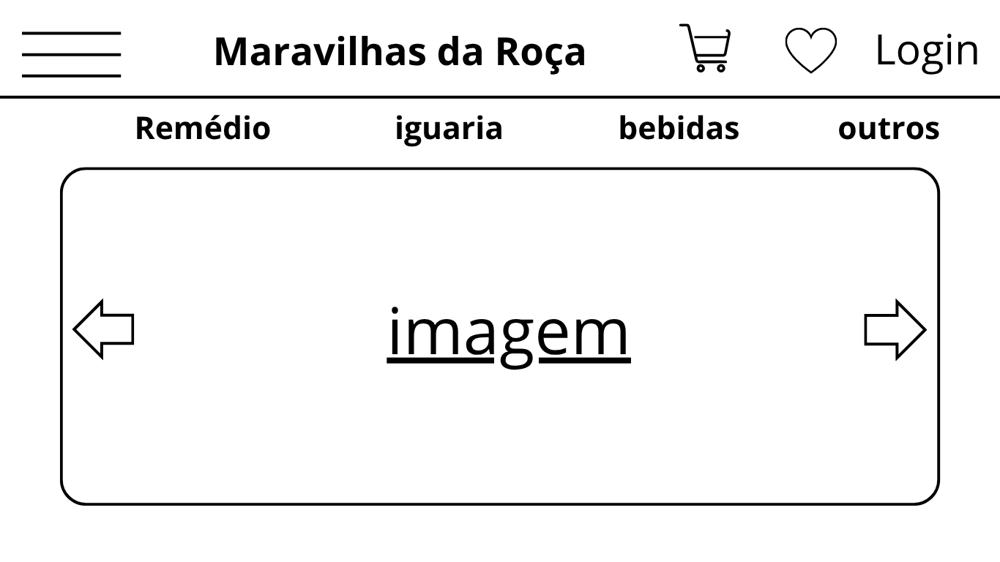
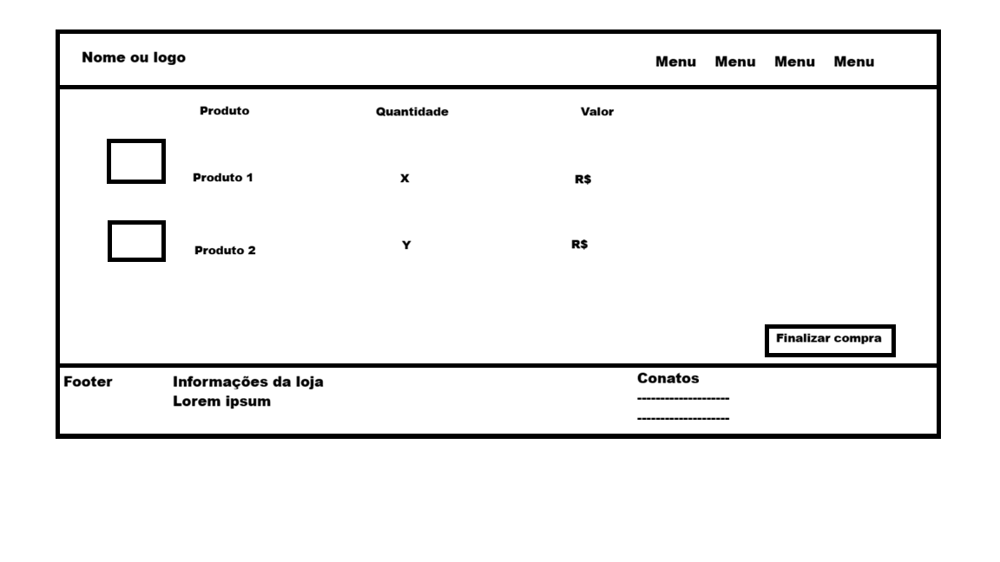
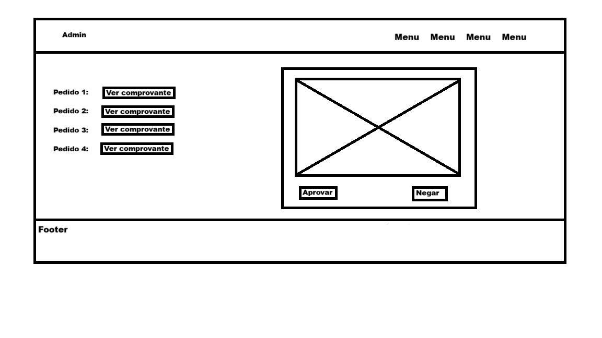
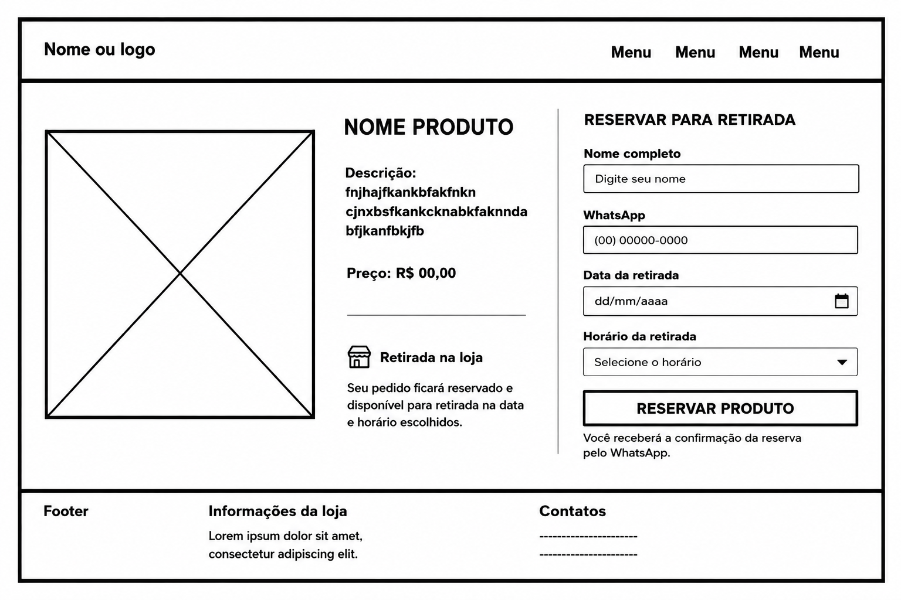
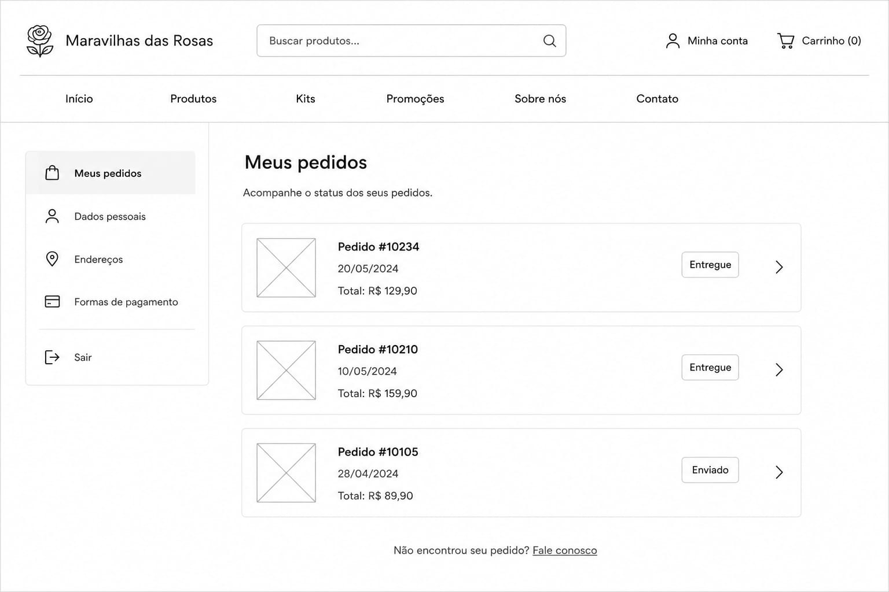
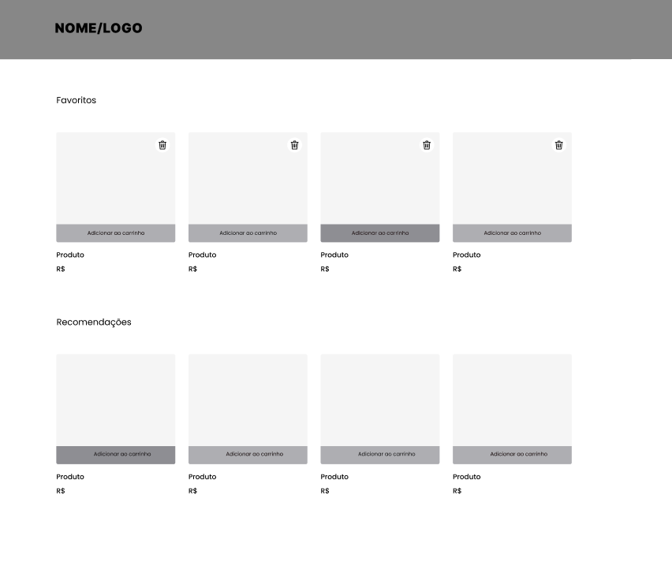
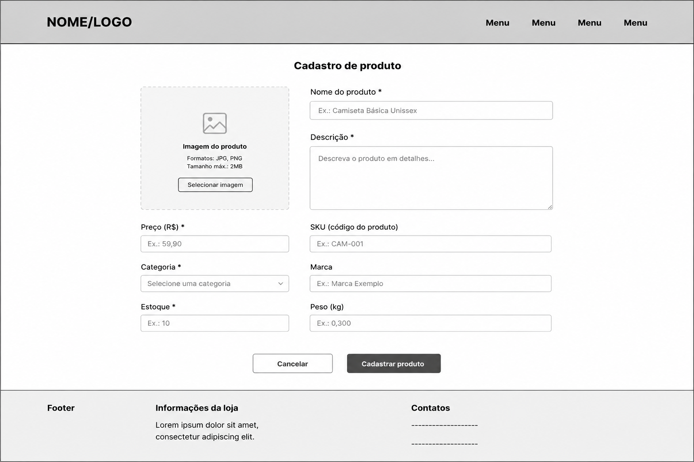
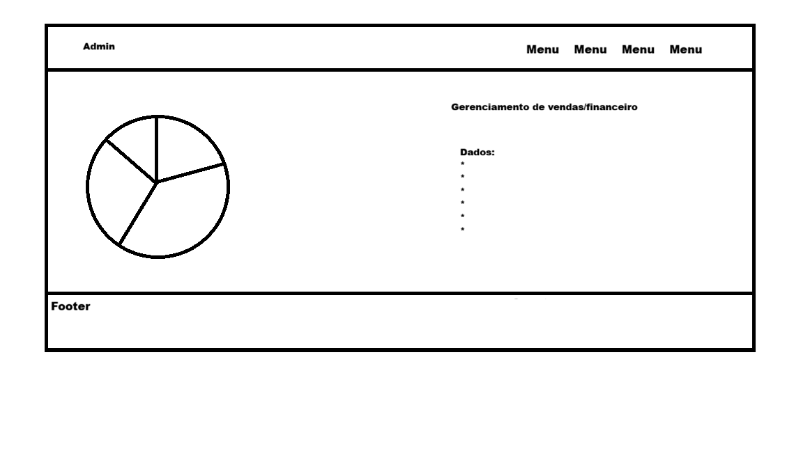
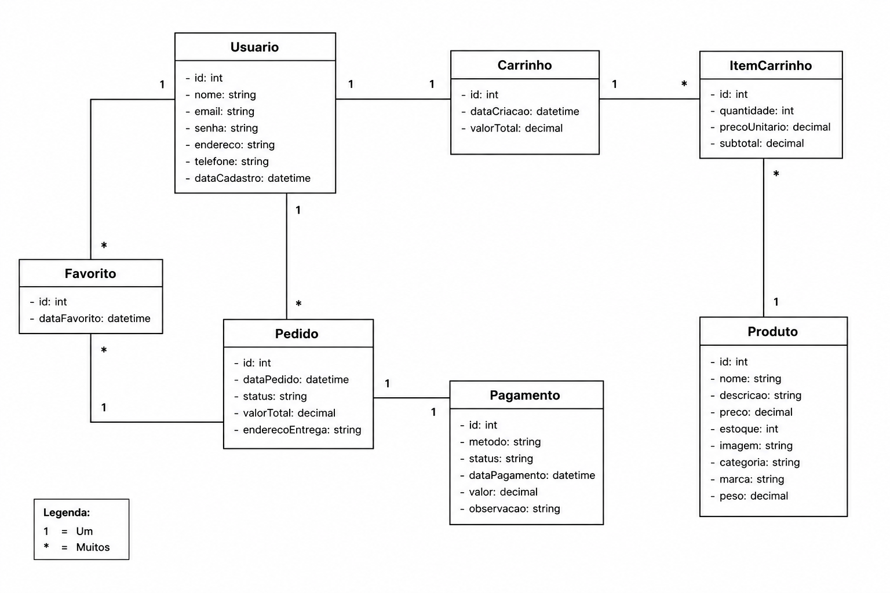

## 4. Projeto da Solução

Pré-requisitos: <a href="03-Modelagem do Processo de Negocio.md"> Modelagem do Processo de Negocio</a>

## 4.1. Arquitetura da solução
A solução utiliza uma arquitetura Web Multi-Camadas, separando a interface do utilizador, a lógica de processamento e o armazenamento de dados para garantir escalabilidade e facilidade de manutenção.

[Arquitetura da solução](images/Arquitetura.drawio.png)

### Módulos e Tecnologias
Front-end (Interface): Desenvolvido com HTML5, CSS3 e JavaScript, focado em acessibilidade para o público idoso e agilidade para o público fitness. Inclui a vitrine virtual e o painel administrativo (CRUD).

Back-end (Lógica): Atua como uma API que gere o processamento de pedidos, validação de stock e integração com WhatsApp para notificações de prontidão.

Dados (Persistência): Utiliza um SGBD Relacional (SQL) para armazenar informações de clientes, produtos, stock e histórico financeiro com total integridade.

### Descrição do Diagrama
O diagrama ilustra o fluxo de dados entre os utilizadores e o sistema. O Cliente e a Comerciante interagem com a interface web, que comunica com a API para realizar operações no Banco de Dados. Este modelo resolve a falha de comunicação do processo anterior, garantindo que o stock visível no site seja o real e que a gestão financeira da loja seja automatizada e centralizada.

 
### 4.2. Protótipos de telas
Visão geral da interação do usuário pelas telas do sistema e protótipo interativo das telas com as funcionalidades que fazem parte do sistema (wireframes).
Apresente as principais interfaces da plataforma. Discuta como ela foi elaborada de forma a atender os requisitos funcionais, não funcionais e histórias de usuário abordados nas <a href="02-Especificação do Projeto.md"> Especificação do Projeto</a>.
A partir das atividades de usuário identificadas na seção anterior, elabore o protótipo de tela de cada uma delas.

#### Home (Vitrine Dinâmica):

Função: Exibição de todos os produtos cadastrados no banco de dados. Buscando atender aos requisitos de acessibilidade e busca rápida.

#### Página de Produto (Detalhes):

Função: Apresentar descrição técnica, benefícios e disponibilidade em tempo real.

#### Carrinho de Compras e Finalização de Pedido:

Função: Revisão dos itens selecionados.

#### Pagamento e Confirmação:

Função: Interface para análise de pagamentos.

#### Reserva:

Função: Interface para instruções para retirada ou entrega.

#### Área de Pedidos (Cliente):

Função: Histórico para o usuário acompanhar suas reservas e status de prontidão

#### Favoritos:

Função: Página de armazenamento de produtos favoritos.

#### Painel Administrativo (Gestão):

Cadastro, Edição e Exclusão de Itens: Interface intuitiva para a comerciante manter o estoque atualizado.

Gerenciamento Financeiro e Cadastrar Compra: Dashboards simples para controle de faturamento e registro de vendas, eliminando a dependência de anotações em papel.

#### Cadastro e Login:

Função: Identificação do usuário para garantir a segurança das reservas e personalização do atendimento.

## 4.3. Diagrama de Classes

### 4.4. Modelo de dados

O desenvolvimento da solução proposta requer a existência de bases de dados que permitam efetuar os cadastros de dados e controles associados aos processos identificados, assim como recuperações.
Utilizando a notação do DER (Diagrama Entidade e Relacionamento), elaborem um modelo, na ferramenta visual indicada na disciplina, que contemple todas as entidades e atributos associados às atividades dos processos identificados. Deve ser gerado um único DER que suporte todos os processos escolhidos, visando, assim, uma base de dados integrada. O modelo deve contemplar, também, o controle de acesso de usuários (partes interessadas dos processos) de acordo com os papéis definidos nos modelos do processo de negócio.
_Apresente o modelo de dados por meio de um modelo relacional que contemple todos os conceitos e atributos apresentados na modelagem dos processos._

#### 4.4.1 Modelo ER

O Modelo ER representa (através de um diagrama como as entidades) se relacionam entre si na aplicação em que estamos desenvolvendo para a empresa Maravilhas da Roça.

#### 4.4.2 Esquema Relacional

O Esquema Relacional corresponde à representação dos dados em tabelas juntamente com as restrições de integridade e chave primária.
 

---

#### 4.4.3 Modelo Físico

<code>

-- Criação da tabela Usuario
CREATE TABLE Usuario (
UsuCodigo INTEGER PRIMARY KEY, 
UsuNome VARCHAR(100), 
UsuLogin VARCHAR(50) UNIQUE,
UsuSenha VARCHAR(255),
UsuEmail VARCHAR(100),
UsuTipo VARCHAR(20)
);

-- Criação da tabela Cliente
CREATE TABLE Cliente (
CliCodigo INTEGER PRIMARY KEY,
CliNome VARCHAR(100),
CliTelefone VARCHAR(20),
UsuCodigo INTEGER,
FOREIGN KEY (UsuCodigo) REFERENCES Usuario(UsuCodigo)
);

-- Criação da tabela Produto
CREATE TABLE Produto (
ProCodigo INTEGER PRIMARY KEY,
ProNome VARCHAR(100),
ProPreco DECIMAL(10,2),
ProEstoque INTEGER
);

-- Criação da tabela Venda
CREATE TABLE Venda (
VenCodigo INTEGER PRIMARY KEY,
CliCodigo INTEGER,
Data DATE,
Total DECIMAL(10,2),
FOREIGN KEY (CliCodigo) REFERENCES Cliente(CliCodigo)
);

-- Criação da tabela ItensVenda
CREATE TABLE ItensVenda (
IteCodigo INTEGER PRIMARY KEY,
VenCodigo INTEGER,
ProCodigo INTEGER,
Quantidade INTEGER,
PrecoUnitario DECIMAL(10,2),
FOREIGN KEY (VenCodigo) REFERENCES Venda(VenCodigo),
FOREIGN KEY (ProCodigo) REFERENCES Produto(ProCodigo)
);

</code>

### 4.5. Tecnologias

Para a implementação da solução Maravilhas da Roça, optamos por uma stack tecnológica moderna focada em performance, segurança de dados e facilidade de manutenção. A escolha do ecossistema JavaScript/TypeScript permite uma integração fluida entre o front-end e o back-end.

#### Tecnologias Envolvidas:

##### Linguagens de Programação:

TypeScript: Utilizado em todo o projeto para adicionar tipagem estática ao JavaScript, reduzindo erros em tempo de desenvolvimento e melhorando a documentação do código.

Front-end (Interface):

Vue.js (Versão 3): Framework progressivo para a criação de interfaces reativas e modulares.

Vite: Ferramenta de build que proporciona um ambiente de desenvolvimento ultra-rápido.

Tailwind CSS: Framework utilitário para estilização, garantindo um design responsivo, padronizado e acessível (focado no público idoso e fitness).

Back-end (Servidor):

Node.js & Express.js: Framework minimalista e rápido para a criação da API REST que gerencia as regras de negócio e a comunicação com o banco de dados.

Zod: Biblioteca de declaração e validação de esquemas, utilizada para garantir que os dados recebidos pela API estejam no formato correto antes de serem processados.

##### Banco de Dados (SGBD):

MySQL: Sistema de gerenciamento de banco de dados relacional escolhido pela sua robustez e confiabilidade na gestão de estoques e registros de vendas.

##### Ferramentas e IDEs:

Visual Studio Code (VS Code): Ambiente de desenvolvimento principal.

Git & GitHub: Para controle de versionamento e colaboração da equipe.

Figma: Para o design dos protótipos de interface (Wireframes).

Draw.io: Para a modelagem de diagramas (Arquitetura, Classes e DER).

Serviços de Deploy:

Vercel: Hospedagem da interface (Front-end).

Render: Hospedagem do servidor e API (Back-end).

#### Fluxo de Interação do Usuário
A interação do usuário com o sistema segue o modelo Client-Server. Abaixo, descrevemos o ciclo de uma requisição (ex: realizar uma reserva):

Interface (Vue.js + Tailwind): O usuário seleciona um produto e clica em "Reservar". O Front-end valida localmente os campos básicos.

Validação de Saída (Zod + TS): Antes de enviar, o TypeScript garante a estrutura do objeto. O sistema faz uma requisição HTTP (JSON) para o servidor.

Processamento (Express.js): O servidor recebe a requisição. A biblioteca Zod valida se os dados (ID do produto, quantidade, cliente) são verídicos e seguros.

Persistência (MySQL): O Express executa uma query ao banco de dados para verificar o estoque real e registrar a reserva.

Resposta: O banco confirma a operação, o Express envia um status de sucesso (200 OK) para o front-end, que atualiza a tela do usuário confirmando a reserva.
